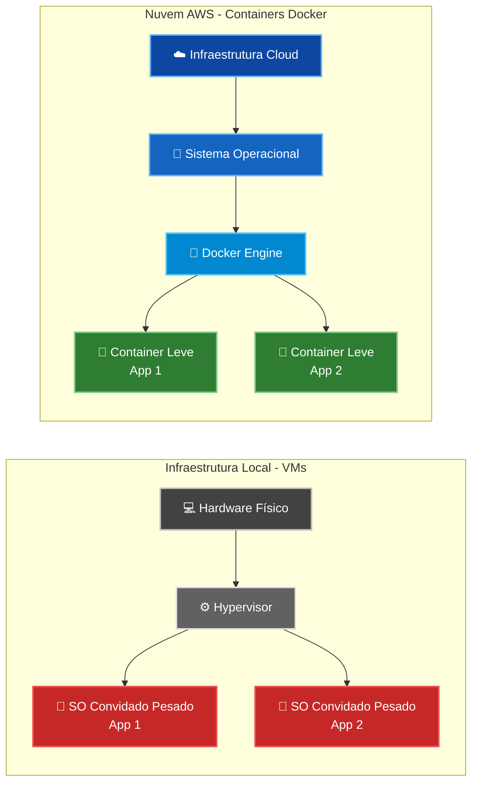
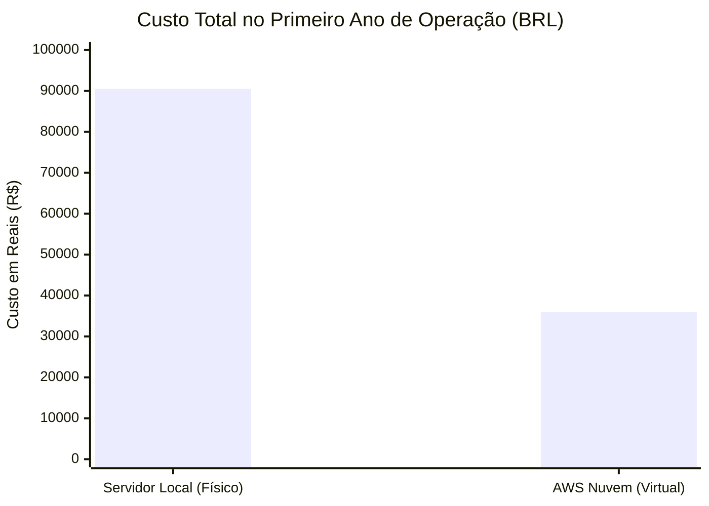
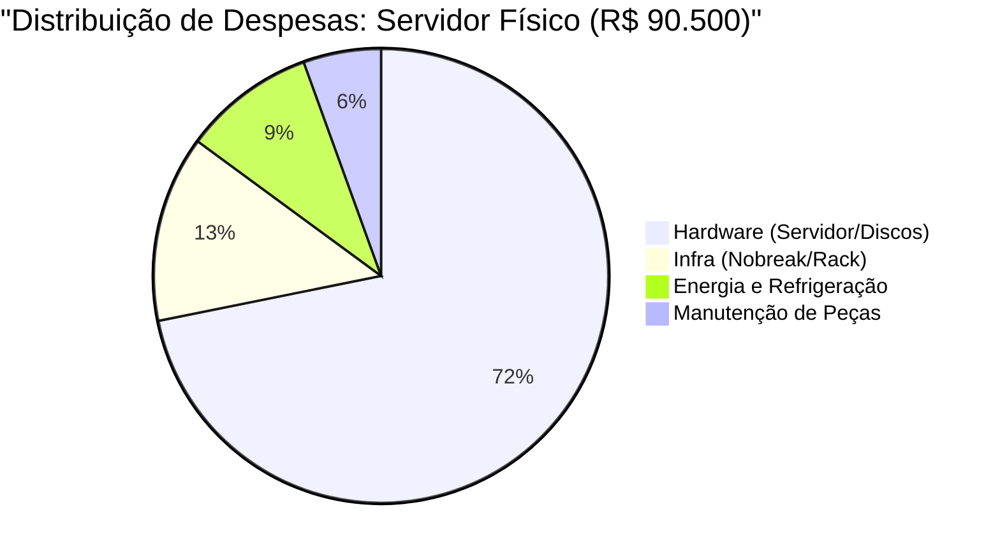

# 🚀 Estudo de Caso I: Transformação Digital da DevStore
> **Projeto de Modernização de Infraestrutura, Virtualização e Cloud Computing.**

Este documento apresenta o planejamento estratégico para a **DevStore**, uma startup de desenvolvimento web que busca resolver gargalos de escalabilidade, altos custos e falta de padronização em seus processos por meio de novas arquiteturas de sistemas operacionais.

---

## 📊 Diagnóstico da Situação Atual

A DevStore enfrenta um cenário crítico que impede seu crescimento sustentável:
1. **Infraestrutura Local:** Uso de servidores físicos sem padronização e com alto custo de manutenção.
2. **Pipeline Frágil:** Desenvolvimento direto na máquina local, sem testes ou versionamento estruturado.
3. **Inconsistência:** O famoso problema do "na minha máquina funciona", devido à falta de ambientes isolados.

---

## 🗨️ Diálogo Técnico: Alinhamento de Soluções

### Fase 1: O Problema do Desenvolvimento
**Cliente (DevStore):** "Nossos desenvolvedores perdem muito tempo configurando ambientes e, quando o código vai para o servidor, tudo quebra. Como resolver isso?"

**Consultoria:** "O problema está na falta de **Containerização**. Hoje, o fluxo de vocês não tem portabilidade. Vamos implementar o **Docker**. Ele cria um pacote contendo a aplicação e todas as dependências, garantindo que o software rode exatamente da mesma forma em qualquer lugar."

### Fase 2: Virtualização vs. Containers
**Cliente:** "Ouvi dizer que máquinas virtuais (VMs) são mais seguras. Não deveríamos usar apenas elas?"

**Consultoria:** "As VMs oferecem um isolamento excelente, mas cada uma exige um Sistema Operacional completo, o que consome muita CPU e RAM desnecessariamente para aplicações web. Os **Containers** são muito mais leves e rápidos. Nossa estratégia será híbrida: Usaremos a Nuvem para isolar a rede e containers para rodar as aplicações com máxima performance."

### Fase 3: Operação em Nuvem e Segurança
**Cliente:** "E se o site cair em um dia de grande acesso? E os nossos dados?"

**Consultoria:** "Migraremos para a **AWS (Amazon Web Services)**. Com a computação em nuvem, temos **Alta Disponibilidade** e **Escalabilidade sob demanda**. Se o tráfego aumentar, a AWS cria novos servidores automaticamente. A segurança será garantida por Firewalls, monitoramento em tempo real de hardware e controle rigoroso de permissões de usuários via IAM."

---

## 🗺️ Diagrama de Arquitetura: Infraestrutura Legada vs. Nuvem e Containers

*O fluxograma abaixo ilustra a comparação estrutural entre o modelo atual da DevStore (servidores locais baseados em Máquinas Virtuais) e a nova proposta de modernização utilizando Computação em Nuvem (AWS) e Containerização (Docker).*

---

## 🏛️ Arquitetura de Sistemas: Análise de Componentes

### 1. Arquitetura Legada: Virtualização Baseada em Hardware
A arquitetura atual baseia-se em servidores locais (*On-Premise*) utilizando máquinas virtuais tradicionais.

* **💻 Hardware Físico (*Bare-Metal*):** Sofre de limites físicos rígidos. A escalabilidade exige a compra e instalação manual de novos hardwares, gerando indisponibilidade e altos custos de capital (CAPEX).
* **⚙️ Hypervisor:** Abstrai o hardware físico e o divide em instâncias virtuais isoladas. O desafio é que gera um *overhead* computacional significativo.
* **🧱 Sistema Operacional Convidado (*Guest OS*):** Cada VM possui um Sistema Operacional completo isolado. Isso consome gigabytes de RAM apenas para manter rotinas do próprio SO, roubando recursos que deveriam ir para a aplicação.

### 2. Arquitetura Proposta: Nuvem e Containerização
A nova arquitetura elimina o *overhead* da virtualização tradicional ao utilizar recursos sob demanda (*Cloud Computing*) e virtualização em nível de Sistema Operacional (*Containers*).

* **☁️ Infraestrutura Cloud (AWS):** Substitui o datacenter físico. Fornece recursos elásticos que podem ser expandidos ou reduzidos automaticamente (*Auto Scaling*), transformando CAPEX em OPEX (*Pay-as-you-go*).
* **🐧 Sistema Operacional Hospedeiro (*Host OS*):** Um Sistema Operacional enxuto, otimizado para servidores em nuvem (Linux), que serve como base estável.
* **🐳 Docker Engine (Motor de Containerização):** Utiliza recursos do kernel do Linux (como *namespaces* e *cgroups*) para particionar o SO Hospedeiro, permitindo que múltiplos containers compartilhem o mesmo kernel.
* **🚀 Containers Leves:** Pacotes executáveis que contêm apenas o código, runtime e bibliotecas da aplicação. Garantem **paridade e portabilidade**, iniciando em milissegundos e acabando com a inconsistência de ambientes.

---

## 📊 Síntese Comparativa de Desempenho

| Critério Técnico | Máquinas Virtuais (VMs) | Containers (Docker) |
| :--- | :--- | :--- |
| **Isolamento** | Em nível de Hardware (Hypervisor). | Em nível de Sistema Operacional. |
| **Consumo de Memória** | Gigabytes (SO + App). | Megabytes (Apenas a App). |
| **Tempo de Inicialização**| Minutos (Boot completo do SO). | Segundos ou Milissegundos. |
| **Portabilidade** | Baixa (Dependente do Hypervisor). | Altíssima (Qualquer ambiente com Docker). |

---

## 💰 O Impacto Financeiro: O Custo do "High-End" (Local vs. Nuvem)

Para garantir que a DevStore suporte milhares de acessos simultâneos sem lentidão, simulamos o custo de uma infraestrutura de **Alta Performance (High-End)**. 

No cenário local, isso exige a compra de servidores corporativos de ponta (ex: *Dell PowerEdge*), nobreaks de dupla conversão e refrigeração dedicada. No cenário em nuvem, arquitetamos um ambiente AWS com múltiplas instâncias (EC2), Banco de Dados Gerenciado (RDS) e Load Balancers.

### 📊 Comparativo de Custos High-End (Estimativa do 1º Ano)

| Categoria de Custo | Infraestrutura Local (Física de Ponta) | Infraestrutura AWS (Nuvem Escalável) |
| :--- | :--- | :--- |
| **Hardware (Servidores, RAM ECC, NVMe)** | R$ 65.000,00 (Aquisição) | R$ 0,00 |
| **Infraestrutura Física (Rack, Nobreak 3kVA)**| R$ 12.000,00 (Aquisição) | R$ 0,00 |
| **Energia e Refrigeração (24/7)** | ~ R$ 8.500,00 / ano | R$ 0,00 (Incluso na nuvem) |
| **Manutenção, Peças e Garantia Estendida**| ~ R$ 5.000,00 / ano | R$ 0,00 (Responsabilidade da AWS)|
| **Uso de Recursos (EC2, RDS, S3, Rede)** | R$ 0,00 | ~ R$ 36.000,00 / ano (R$ 3.000/mês)* |
| **Custo Total Estimado (Ano 1)** | **R$ 90.500,00** | **R$ 36.000,00** |

> ***Nota Operacional:** Na AWS, a empresa só começa a pagar os R$ 3.000 mensais quando a aplicação já estiver no ar e faturando. No modelo físico, os R$ 77.000,00 de hardware precisam ser pagos antes mesmo da DevStore ter seu primeiro cliente.*

---

### 📈 Gráficos de Análise Financeira

*Os gráficos abaixo demonstram visualmente a discrepância de custos e o peso da manutenção de datacenters locais.*

#### 1. Comparativo Total: Custo do 1º Ano (Local vs AWS)

#### 2. Para onde vai o dinheiro no Servidor Local? (Composição de Custos)

---

## 📈 Resultados Esperados

Ao final da implantação, a DevStore terá:
- **Redução drástica no tempo de deploy** devido à padronização com Docker e pipeline automatizado (Git/GitHub).
- **Disponibilidade superior** utilizando zonas de disponibilidade da AWS.
- **Segurança aprimorada** com monitoramento contínuo via Prometheus/Grafana e controle de acessos estruturado.
- **Redução de custo de infraestrutura inicial de mais de 60%**.

---

## 📚 Referências Bibliográficas

* TANENBAUM, Andrew S.; BOS, Herbert. *Sistemas Operacionais Modernos*. 4. ed. São Paulo: Pearson, 2016.
* SILBERSCHATZ, Abraham; GALVIN, Peter B.; GAGNE, Greg. *Fundamentos de Sistemas Operacionais*. 9. ed. Rio de Janeiro: LTC, 2015.
* AWS. *Documentação Oficial da Amazon Web Services*.
* DOCKER INC. *Docker Documentation*.
